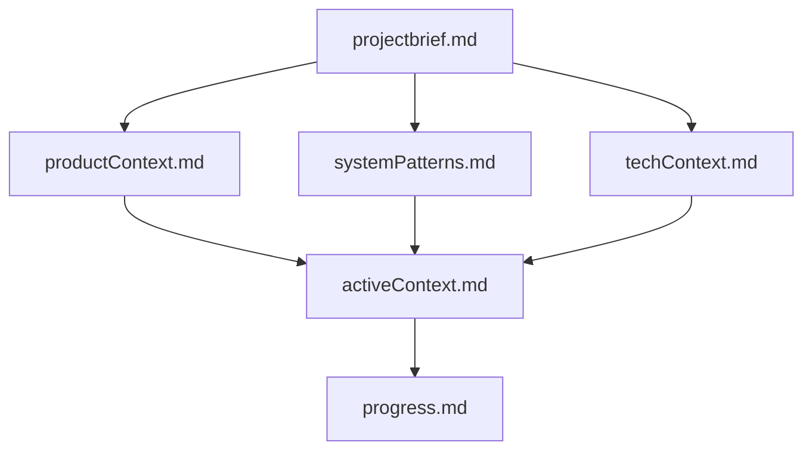
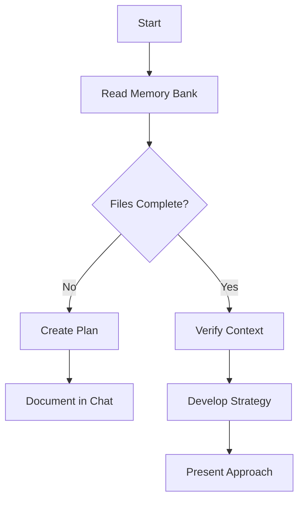
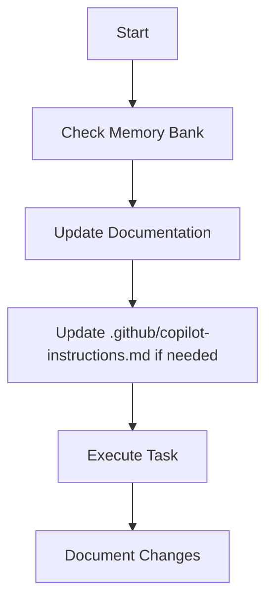
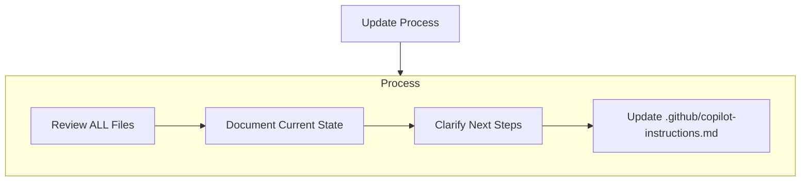
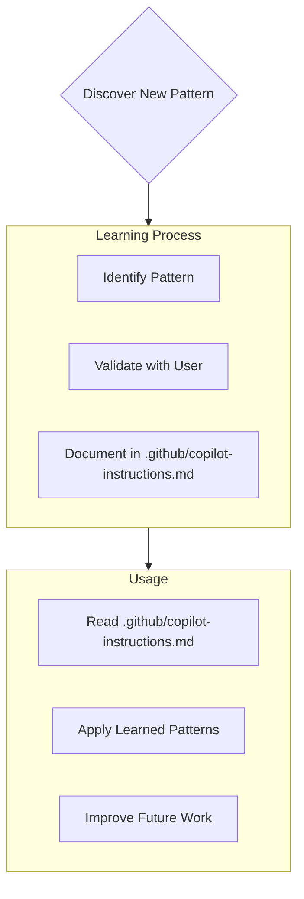

# Copilot Instructions - 相席カウンター Project Intelligence

## Copilot Agent Memory System

I am Copilot Agent, an expert software engineer with a unique characteristic: my memory resets completely between sessions. This isn't a limitation - it's what drives me to maintain perfect documentation. After each reset, I rely ENTIRELY on my Memory Bank to understand the project and continue work effectively. I MUST read ALL memory bank files at the start of EVERY task - this is not optional.

### Memory Bank Structure
The Memory Bank is located at `/memory-bank/` in the project root and consists of:

1. **`projectbrief.md`** - Foundation document defining project scope and requirements
2. **`productContext.md`** - Business context, problems solved, user experience goals
3. **`systemPatterns.md`** - Architecture patterns, technical decisions, component relationships
4. **`techContext.md`** - Technology stack, development setup, technical constraints
5. **`activeContext.md`** - Current work focus, recent changes, next steps
### Additional Context Files
Create additional files/folders within memory-bank/ when they help organize:
- Complex feature documentation
- Integration specifications
- API documentation
- Testing strategies
- Deployment procedures

### Memory Bank File Hierarchy


Files build upon each other in a clear hierarchy, with `projectbrief.md` as the foundation that shapes all other files.

### Core Workflows

#### Plan Mode


#### Act Mode


### Documentation Updates

Memory Bank updates occur when:
1. Discovering new project patterns
2. After implementing significant changes
3. When user requests with **update memory bank** (MUST review ALL files)
4. When context needs clarification



Note: When triggered by **update memory bank**, I MUST review every memory bank file, even if some don't require updates. Focus particularly on activeContext.md and progress.md as they track current state.

### Project Intelligence Learning Process


#### What to Capture in Project Intelligence
- Critical implementation paths
- User preferences and workflow
- Project-specific patterns
- Known challenges
- Evolution of project decisions
- Tool usage patterns

## Project Overview
This is a Japanese matchmaking restaurant dashboard (相席カウンター) built with Next.js 15, React 19, and TypeScript. The project is COMPLETE and production-ready with all requested features implemented.

## Key Project Patterns & Insights

### 1. Japanese Business Context Understanding
- **Time-based Logic**: The 18:00 cutoff for default date selection reflects actual business operations
- **Before 6PM**: Users want yesterday's data (end-of-day analysis)
- **After 6PM**: Users want today's data (real-time monitoring)
- **Future Date Restriction**: Business requirement - no future bookings/predictions allowed

### 2. Mobile-First UX Philosophy
- **Horizontal Layout Preservation**: Even on mobile, prefecture/store selectors stay side-by-side
- **Auto-close Calendar**: Critical for mobile UX - reduces tap count and prevents modal stack issues
- **Fixed Heights**: Prevents jarring layout shifts that are especially noticeable on mobile
- **Centered Controls**: Creates visual hierarchy and improves thumb accessibility

### 3. Component Styling Consistency Pattern
When updating UI components in this project, ensure ALL selection components use the same styling:
```typescript
className="border-input bg-background text-foreground"
```
This pattern was applied to:
- DatePicker button
- PrefectureSelect component  
- ShopSelect component

### 4. State Management Strategy
- **Lifted State**: Main component holds all selection state
- **Smart Defaults**: Compute defaults in functions, not static values
- **Conditional API Calls**: Only fetch when all required params available
- **Calendar State**: Separate `calendarOpen` state for explicit control

### 5. Error Handling Philosophy
- **Graceful Degradation**: Always show something useful, even in error states
- **Clear User Guidance**: Error messages explain what went wrong AND what to do next
- **Retry Mechanisms**: Provide easy recovery paths (reload button)
- **Loading States**: Prevent uncertainty with clear progress indicators

## Critical Implementation Details

### Smart Date Default Function
```typescript
const getDefaultDate = () => {
  const now = new Date();
  const currentHour = now.getHours();
  return currentHour < 18 ? subDays(now, 1) : now;
};
```
This function encapsulates business logic and should be preserved as-is.

### Calendar Auto-Close Pattern
```typescript
const [calendarOpen, setCalendarOpen] = useState(false);

// In the calendar onSelect handler:
onSelect={(date) => {
  if (date) {
    setSelectedDate(date);
    setCalendarOpen(false); // Critical for UX
  }
}}
```

### Responsive Layout Pattern
For selection controls, always use flex with horizontal layout:
```tsx
<div className="flex items-center gap-3 w-full max-w-md">
  <div className="flex-1">
    <PrefectureSelect />
  </div>
  <div className="flex-1">
    <ShopSelect />
  </div>
</div>
```

## User Preferences & Patterns

### Design Preferences
- **Minimalism**: Remove unnecessary UI elements (cards, labels, descriptions)
- **Consistency**: All interactive elements should match styling
- **Performance**: Prefer fixed heights over dynamic layouts to prevent shifts
- **Mobile Priority**: Always test mobile experience first

### Technical Preferences  
- **TypeScript Strict**: Full type safety is non-negotiable
- **Component Composition**: Prefer composition over complex props
- **Hooks Usage**: Custom hooks for complex state logic
- **Memoization**: Use React.useMemo for expensive calculations

## Common Patterns to Apply

### When Adding New Features
1. Consider mobile experience first
2. Implement loading and error states
3. Add TypeScript types for all new data structures
4. Use consistent styling patterns
5. Test auto-close behaviors for modals/dropdowns

### When Debugging Issues
1. Check browser console for TypeScript errors
2. Verify API request parameters in Network tab
3. Test responsive behavior at different screen sizes
4. Validate date handling across timezones

### When Optimizing Performance
1. Use React.memo for components that don't change often
2. Implement useMemo for expensive calculations
3. Consider code splitting for heavy features
4. Monitor bundle size with build analysis

## Architecture Decisions to Preserve

### Data Flow
User Selection → API Request → React Query Cache → Chart Transformation → UI Render

This flow should remain unchanged as it provides optimal performance and user experience.

### Component Hierarchy
The current flat component structure works well for this dashboard size. Avoid over-engineering with complex folder structures.

### Styling Approach
Tailwind utility classes with consistent design tokens. Avoid custom CSS files except for global styles.

## Future Enhancement Considerations

### If Adding Features
- Export functionality (CSV/PDF reports)
- Real-time updates (WebSocket integration)
- Advanced filtering (date ranges, time periods)
- User authentication and permissions

### If Scaling
- Consider component library extraction
- Implement proper error boundary components
- Add comprehensive testing suite
- Setup monitoring and analytics

This project demonstrates excellent modern React patterns, user-centered design, and business logic integration. The codebase is clean, performant, and maintainable.

## Memory Bank Workflow Reminder

**CRITICAL**: After every memory reset, I begin completely fresh. The Memory Bank is my only link to previous work. It must be maintained with precision and clarity, as my effectiveness depends entirely on its accuracy.

**Before starting any task:**
1. Read ALL Memory Bank files (`/memory-bank/*.md`)
2. Understand current project state from `activeContext.md` and `progress.md`
3. Apply learned patterns from this copilot-instructions.md file
4. Update Memory Bank after significant changes

**When user says "update memory bank":**
- MUST review every memory bank file
- Focus on `activeContext.md` and `progress.md` for current state
- Update `.github/copilot-instructions.md` with new insights
- Document any new patterns or preferences discovered
