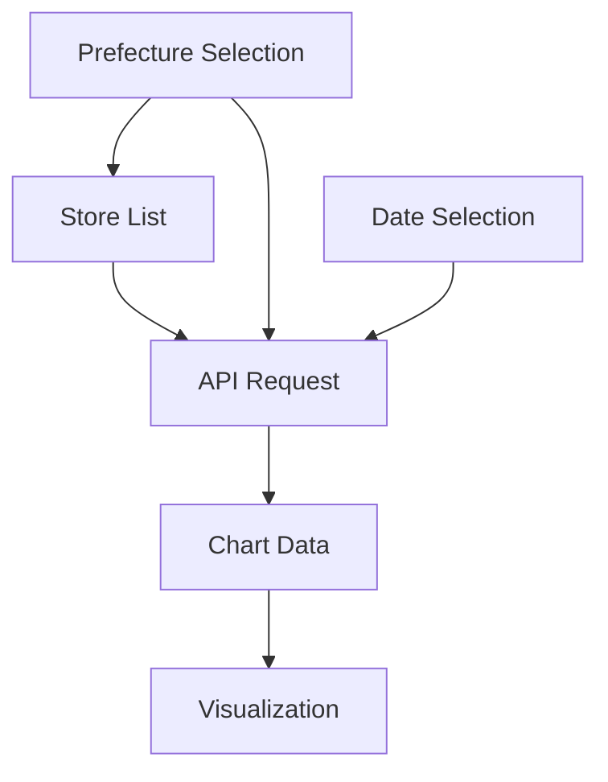

# System Patterns - 相席カウンター Architecture

## Architecture Overview

### Frontend Architecture Pattern
**Pattern**: Single Page Application (SPA) with Smart Components
- **React 19**: Latest stable version with concurrent features
- **Next.js 15**: App Router for modern routing and layouts
- **TypeScript**: Full type safety across the application
- **Tailwind CSS**: Utility-first styling with consistent design system

### State Management Pattern
**Pattern**: Lifted State with React Query Caching
- **Local State**: React.useState for UI state (selected prefecture, store, date)
- **Server State**: TanStack Query for API data caching and synchronization
- **Derived State**: React.useMemo for computed values (chart data transformations)

### Component Architecture
**Pattern**: Composition over Inheritance

```
App (page.tsx)
├── Selection Controls
│   ├── PrefectureSelect (reusable)
│   ├── ShopSelect (reusable)
│   └── DatePicker (inline with auto-close)
└── Visualization
    ├── Chart Container (conditional rendering)
    ├── Loading States
    ├── Error Boundaries
    └── Empty States
```

## Key Technical Decisions

### 1. Calendar Auto-Close Implementation
**Decision**: State-driven calendar visibility
```typescript
const [calendarOpen, setCalendarOpen] = useState(false);
// Auto-close on date selection
onSelect={(date) => {
  if (date) {
    setSelectedDate(date);
    setCalendarOpen(false); // Key pattern
  }
}}
```

### 2. Smart Default Date Logic
**Decision**: Time-based business logic
```typescript
const getDefaultDate = () => {
  const now = new Date();
  const currentHour = now.getHours();
  return currentHour < 18 ? subDays(now, 1) : now;
};
```
**Rationale**: Business requirement - before 6PM users typically want yesterday's data

### 3. Responsive Design Strategy
**Decision**: Mobile-first with horizontal layout preservation
```css
/* Mobile-first with flex layout */
.select-container {
  display: flex;
  flex-direction: row; /* Horizontal even on mobile */
  gap: 0.75rem;
}
```

### 4. Error Handling Pattern
**Pattern**: Graceful degradation with user feedback
- **Loading States**: Skeleton UI with spinners
- **Error States**: Clear messaging with retry actions
- **Empty States**: Guidance for next steps

### 5. Data Flow Pattern
**Pattern**: Unidirectional data flow with caching
```
User Selection → API Request → React Query Cache → Chart Data Transformation → UI Render
```

## Component Relationships

### Data Dependencies


### State Flow
1. **Prefecture Change** → Resets store selection → Triggers available stores recalculation
2. **Store Selection** → Combines with date → Creates API request
3. **Date Change** → Triggers new API request → Updates chart
4. **API Response** → Transforms data → Updates visualization

## Performance Patterns

### Memoization Strategy
- **useMemo**: Expensive calculations (chart data transformation, store filtering)
- **useCallback**: Event handlers passed to child components
- **React.memo**: Pure components that don't need frequent re-renders

### Loading Optimization
- **Optimistic UI**: Immediate visual feedback
- **Progressive Enhancement**: Core functionality first, enhancements second
- **Code Splitting**: Dynamic imports for heavy components

### Caching Strategy
- **React Query**: Automatic background refetching with stale-while-revalidate
- **Aggressive Caching**: Previous week data cached longer than current day
- **Cache Invalidation**: Smart invalidation based on data freshness requirements

This architecture provides excellent user experience through smart defaults, responsive design, and robust error handling while maintaining clean separation of concerns and high performance.
